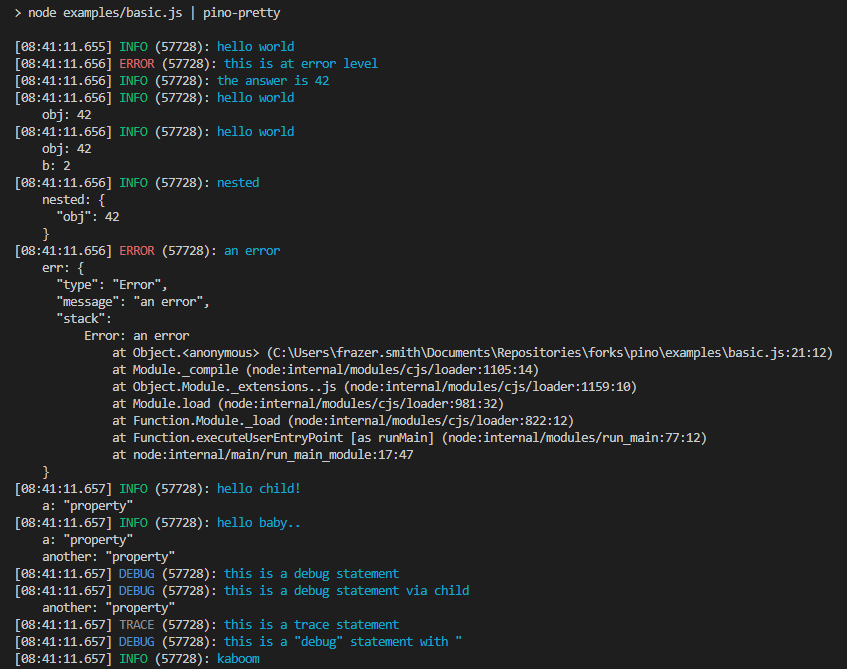

<a id="intro"></a>
# pino-pretty

This module provides a basic log prettifier for the [Pino](https://getpino.io/)
logging library. It reads a standard Pino log line like:

```
{"level":30,"time":1522431328992,"msg":"hello world","pid":42,"hostname":"foo","v":1}
```

And formats it to:

```
[1522431328992] INFO (42 on foo): hello world
```

<a id="example"></a>
## Example

Using the [example script][exscript] from the Pino module, and specifying
that logs should be colored and the time translated, we can see what the
prettified logs will look like:



[exscript]: https://github.com/pinojs/pino/blob/fc4c83b/example.js

<a id="install"></a>
## Install

```sh
$ npm install -g pino-pretty
```

<a id="cliargs"></a>
## CLI Arguments

+ `--colorize` (`-c`): Adds terminal color escape sequences to the output.
+ `--crlf` (`-f`): Appends carriage return and line feed, instead of just a line
feed, to the formatted log line.
+ `--dateFormat` (`-d`): Sets the format string to apply when translating the date
to human readable format (see: `--translateTime`). The default format string
is `'yyyy-MM-dd HH:mm:ss.SSS Z'`. For a list of available patter letters
see the [js-joda DateTimeFormatter#ofPattern documentation](https://js-joda.github.io/js-joda/esdoc/class/src/format/DateTimeFormatter.js~DateTimeFormatter.html#static-method-ofPattern).
+ `--errorProps` (`-e`): When formatting an error object, display this list
of properties. The list should be a comma separated list of properties Default: `''`.
+ `--levelFirst` (`-l`): Display the log level name before the logged date and time.
+ `--errorLikeObjectKeys` (`-k`): Define the log keys that are associated with
error like objects. Default: `err,error`.
+ `--messageKey` (`-m`): Define the key that contains the main log message.
Default: `msg`.
+ `--localTime` (`-n`): When translating the time to a human readable format,
use the system timezone for displaying the time.
+ `--translateTime` (`-t`): Translate the epoch time value into a human readable
date and time string. See `--dateFormat` for information on the output format.

<a id="api"></a>
## API

`pino-pretty` exports a factory function that can be used to format log strings.
It accepts an options argument with keys corresponding to the options described
in [CLI Arguments](#cliargs):

```js
{
  colorize: false, // --colorize
  crlf: false, // --crlf
  dateFormat: 'yyyy-MM-dd HH:mm:ss.SSS Z', // --dateFormat
  errorLikeObjectKeys: ['err', 'error'], // --errorLikeObjectKeys
  errorProps: '', // --errorProps
  levelFirst: false, // --levelFirst
  localTime: false, // --localTime
  messageKey: 'msg', // --messageKey
  translateTime: false, // --translateTime
  useMetadata: false,
  outputStream: process.stdout
}
```

Unless `useMetadata` is set to `true`, the factory function returns the
function: `function pretty (line) {}`. See the [next subsection](#usemetadata)
for information on the other case.

<a id="usemetadata"></a>
### `useMetadata` and `outputStream`

If the `useMetadata` option is set to `true`, then the factory function will
return an object that can be supplied directly to Pino as a stream that is
compatible with Pino's [metadata stream API][mdstream]. This allows `pino-pretty`
to skip the expensive task of parsing JSON log lines and instead work directly
with Pino's log object.

When `useMetadata` is set to `true` then the `outputStream` option dictates
where the final formatted log line will be written. This must be a writable
stream. The default stream is `process.stdout`.

[mdstream]: https://github.com/pinojs/pino/blob/fc4c83b/docs/API.md#metadata

<a id="license"><a>
## License

MIT License
